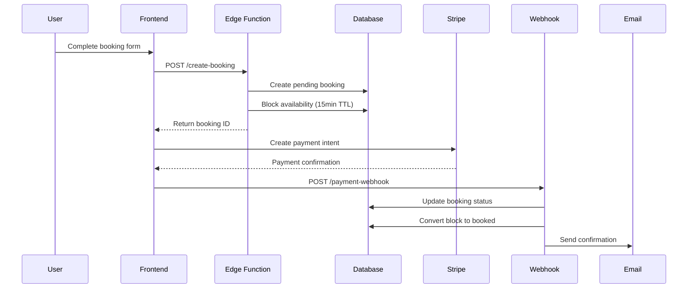

# LuxeDrive Car Rental - Production Backend

Complete backend system for a premium car rental platform built on **Lovable Cloud** (Supabase) with PostgreSQL, serverless edge functions, JWT authentication, and payment integration.

---

## 🏗️ Architecture Overview

```
┌─────────────────┐
│   React App     │ (Frontend)
└────────┬────────┘
         │
         ▼
┌─────────────────────────────────────┐
│      Lovable Cloud (Supabase)       │
│                                     │
│  ┌──────────────┐  ┌─────────────┐ │
│  │  PostgreSQL  │  │ Edge Funcs  │ │
│  │   Database   │  │ (Deno/TS)   │ │
│  └──────────────┘  └─────────────┘ │
│                                     │
│  ┌──────────────┐  ┌─────────────┐ │
│  │  Auth (JWT)  │  │   Storage   │ │
│  └──────────────┘  └─────────────┘ │
└─────────────────────────────────────┘
         │
         ▼
   ┌──────────────────────┐
   │  External Services   │
   │  • Stripe (Payments) │
   │  • Resend (Emails)   │
   └──────────────────────┘
```

---

## 📦 Technology Stack

| Component | Technology | Purpose |
|-----------|------------|---------|
| **Database** | PostgreSQL | Relational data storage with ACID compliance |
| **API Layer** | Supabase Edge Functions (Deno) | Serverless API endpoints |
| **Authentication** | Supabase Auth (JWT) | User authentication & authorization |
| **ORM** | Supabase Client | Type-safe database queries |
| **Payments** | Stripe (Test Mode) | Payment processing simulation |
| **Emails** | Resend | Transactional emails |
| **Storage** | Supabase Storage | File uploads (optional) |
| **Real-time** | Supabase Realtime | WebSocket subscriptions |

---

## 🗄️ Database Schema

### Core Tables

| Table | Description | Key Features |
|-------|-------------|--------------|
| `profiles` | User profiles | Auto-created on signup |
| `user_roles` | User role assignments | Separate table for security |
| `locations` | Pickup/dropoff locations | City, state, coordinates |
| `agencies` | Car rental agencies (hosts) | Ratings, location |
| `cars` | Vehicle inventory | Pricing in paise, features JSON |
| `car_availability` | Availability tracking | Booking locks, TTL expiry |
| `addons` | Extra services | GPS, insurance, child seat, etc. |
| `promo_codes` | Discount codes | Percentage or fixed discounts |
| `bookings` | Rental bookings | Full price breakdown |
| `payments` | Payment transactions | Stripe integration |
| `reviews` | Car reviews | Only after completed bookings |
| `audit_logs` | Admin actions tracking | Compliance & debugging |

### ENUM Types

```sql
app_role: 'user' | 'host' | 'admin'
booking_status: 'pending' | 'confirmed' | 'cancelled' | 'completed'
payment_status: 'pending' | 'succeeded' | 'failed' | 'refunded'
availability_status: 'available' | 'booked' | 'blocked'
discount_type: 'percent' | 'fixed'
transmission_type: 'automatic' | 'manual'
fuel_type: 'petrol' | 'diesel' | 'electric' | 'hybrid'
```

---

## 🔐 Security Architecture

### Row Level Security (RLS)

All tables have RLS enabled with policies enforcing:

- **Profiles**: Users can view all, update only their own
- **Bookings**: Users can only see/create their own bookings
- **Cars**: Public read for active cars, hosts manage their own
- **Admin**: Admins bypass restrictions via `has_role()` function
- **Payments**: Users can only view their own payment records

### Security Definer Functions

```sql
-- Prevents RLS recursion issues
CREATE FUNCTION has_role(_user_id UUID, _role app_role)
RETURNS BOOLEAN
SECURITY DEFINER
SET search_path = public;
```

### Authentication Flow

1. **Signup** → Auto-creates profile & assigns 'user' role
2. **Login** → Returns JWT access token (15min) + refresh token (30d)
3. **Refresh** → Exchange refresh token for new access token
4. **Password Reset** → Email-based token flow

---

## 🚀 Edge Functions (API Endpoints)

### `/calculate-price` (Public)

**Purpose**: Calculate total booking cost with breakdown  
**Features**:
- Day calculation
- Addon pricing
- Promo code validation (`WELCOME10`)
- Tax calculation (18% GST)
- Deposit calculation (20% of total)

**Example Request**:
```json
POST /functions/v1/calculate-price
{
  "carId": "car_123",
  "start": "2025-12-05T10:00:00Z",
  "end": "2025-12-07T10:00:00Z",
  "addons": ["addon_gps"],
  "promoCode": "WELCOME10"
}
```

### `/create-booking` (Authenticated)

**Purpose**: Create pending booking with availability lock  
**Features**:
- Availability check (prevents double-booking)
- Creates 15-minute reservation lock
- Price calculation with promo codes
- Atomic transaction (booking + availability block)

**Flow**:
1. Validate user authentication
2. Check car availability
3. Calculate final pricing
4. Create pending booking
5. Block availability for 15 minutes
6. Return booking ID for payment

### `/list-cars` (Public)

**Purpose**: Search and filter car inventory  
**Features**:
- Full-text search (model/make)
- Filters (transmission, price, seats, fuel)
- Sorting (price, rating)
- Pagination
- Agency details included

**Query Parameters**:
```
?transmission=automatic
&minPrice=2000
&maxPrice=8000
&seats=5
&sortBy=price_asc
&page=1
&limit=12
```

---

## 💳 Payment Integration

### Stripe Setup (Test Mode)

1. **Create Stripe Account**: https://dashboard.stripe.com
2. **Get API Keys**: Dashboard → Developers → API keys
3. **Add Secret**: Use Lovable Cloud secrets manager
4. **Test Cards**:
   - Success: `4242 4242 4242 4242`
   - Decline: `4000 0000 0000 0002`

### Payment Flow



---

## 📧 Email Integration (Resend)

### Setup

1. **Sign up**: https://resend.com
2. **Verify domain**: https://resend.com/domains
3. **Create API key**: https://resend.com/api-keys
4. **Add to secrets**: `RESEND_API_KEY`

### Email Templates

- **Booking Confirmation**: Sent after payment success
- **Booking Cancelled**: Sent on cancellation
- **Password Reset**: Sent on forgot password

---

## 🏁 Quick Start

### Prerequisites

- Node.js 18+ (for frontend)
- Supabase CLI (optional, for local dev)
- Stripe account (test mode)
- Resend account

### 1. Environment Setup

The following environment variables are **auto-configured** by Lovable Cloud:

```env
VITE_SUPABASE_URL=https://zjiycdqtwkrvrojebclv.supabase.co
VITE_SUPABASE_PUBLISHABLE_KEY=eyJhbGci...
VITE_SUPABASE_PROJECT_ID=zjiycdqtwkrvrojebclv
```

### 2. Database Initialization

✅ **Already Complete!** The database schema has been migrated with:

- 12 tables with proper indexes
- Row Level Security policies
- Triggers for auto-updates
- Seed data (locations, addons, WELCOME10 promo)

### 3. Authentication Configuration

✅ **Already Configured!**
- Email auto-confirmation enabled (no email verification required for testing)
- JWT tokens properly configured
- User roles system active

### 4. Add External Service Keys

#### For Stripe Integration:

```bash
# Add via Lovable Cloud Secrets Manager
STRIPE_SECRET_KEY=sk_test_...
STRIPE_WEBHOOK_SECRET=whsec_...
```

#### For Email Integration:

```bash
RESEND_API_KEY=re_...
```

### 5. Test the API

```bash
# Test price calculation (public endpoint)
curl -X POST 'https://zjiycdqtwkrvrojebclv.supabase.co/functions/v1/calculate-price' \\\
  -H 'Content-Type: application/json' \\\
  -d '{
    "carId": "YOUR_CAR_ID",
    "start": "2025-12-05T10:00:00Z",
    "end": "2025-12-07T10:00:00Z",
    "promoCode": "WELCOME10"
  }'

# Test car listing (public endpoint)
curl 'https://zjiycdqtwkrvrojebclv.supabase.co/functions/v1/list-cars?limit=5'
```

---

## 🧪 Testing Strategy

### Unit Tests (Recommended)

Test individual functions in isolation:

```typescript
// Example: Price calculation logic
describe('Price Calculator', () => {
  it('should apply WELCOME10 discount correctly', () => {
    const basePrice = 10000; // ₹100
    const discount = applyPromoCode('WELCOME10', basePrice);
    expect(discount).toBe(1000); // 10%
  });
});
```

### Integration Tests

Test complete booking flow:

1. Create user account
2. List available cars
3. Calculate price with promo code
4. Create booking
5. Simulate payment webhook
6. Verify booking status updated
7. Check availability blocked

### Load Testing

Use tools like Apache JMeter or k6 to test:
- Concurrent booking attempts (prevent double-booking)
- API rate limits
- Database connection pooling

---

## 📊 Performance Optimization

### Database Indexes

✅ Already implemented:
- `idx_cars_price` - Fast price range queries
- `idx_bookings_dates` - Efficient availability checks
- `idx_cars_search` - Full-text search (GIN index)
- `idx_car_availability_car_dates` - Prevent double-booking

### Caching Strategy (Recommended)

```typescript
// Cache car listings (30s TTL)
const CACHE_KEY = `cars:list:${filterHash}`;
const cached = await redis.get(CACHE_KEY);
if (cached) return JSON.parse(cached);

// Fetch from DB
const cars = await fetchCars(filters);

// Cache result
await redis.set(CACHE_KEY, JSON.stringify(cars), 'EX', 30);
```

### Edge Function Best Practices

1. **Connection Pooling**: Supabase client reuses connections
2. **Parallel Queries**: Use `Promise.all()` for independent queries
3. **Projection**: Only select needed columns (`select=id,name`)
4. **Pagination**: Always limit results (`limit=12`)

---

## 🚢 Deployment

### Frontend Deployment

The frontend auto-deploys via Lovable when you click "Publish"

### Backend Deployment

✅ **Edge functions auto-deploy** when you write code!  
No manual deployment needed.

### Production Checklist

- [ ] Disable email auto-confirmation
- [ ] Set up custom email templates
- [ ] Configure rate limiting
- [ ] Add monitoring (Sentry, LogRocket)
- [ ] Set up backup schedule
- [ ] Configure Stripe webhooks
- [ ] Test password reset flow
- [ ] Enable 2FA for admin accounts

---

## 📈 Monitoring & Logging

### Built-in Monitoring

Access via Lovable Cloud dashboard:
- **Database Performance**: Query execution times
- **Edge Function Logs**: Real-time function logs
- **Auth Activity**: Signup/login attempts
- **API Usage**: Request counts per endpoint

### Custom Logging

```typescript
// In edge functions
console.log('Booking created:', {
  bookingId,
  userId,
  totalAmount
});

console.error('Payment failed:', {
  error,
  bookingId
});
```

### Recommended External Tools

- **Error Tracking**: Sentry
- **Performance**: New Relic / DataDog
- **User Analytics**: Mixpanel / Amplitude
- **Uptime Monitoring**: Pingdom / UptimeRobot

---

## 🔧 Troubleshooting

### Common Issues

**1. "Car not available" error when car should be free**

```sql
-- Check blocked/expired availabilities
SELECT * FROM car_availability
WHERE car_id = 'CAR_ID'
AND status = 'blocked'
AND expires_at < NOW();

-- Cleanup expired blocks
DELETE FROM car_availability
WHERE status = 'blocked'
AND expires_at < NOW();
```

**2. RLS policy blocking inserts**

Ensure `user_id` matches `auth.uid()`:
```typescript
const { data, error } = await supabase
  .from('bookings')
  .insert({
    user_id: user.id, // MUST match auth.uid()
    car_id: carId,
    // ... other fields
  });
```

**3. Promo code not applying**

Check:
- Code is uppercase (`WELCOME10`)
- `active = true`
- Within date range
- Usage limit not exceeded
- User hasn't exceeded per-user limit

---

## 📚 Additional Documentation

- **[API Documentation](./API_DOCUMENTATION.md)** - Complete API reference
- **[Database Schema](./SCHEMA.md)** - Detailed table structures
- **[Security Guide](./SECURITY.md)** - Security best practices
- **[Architecture Decisions](./ARCHITECTURE.md)** - Design choices explained

---

## 🤝 Support

- **Backend Dashboard**: <lov-open-backend>View Backend</lov-open-backend>
- **API Docs**: See `docs/API_DOCUMENTATION.md`
- **Issues**: Check logs in Cloud dashboard

---

## 📝 License

Proprietary - LuxeDrive Car Rental Platform
